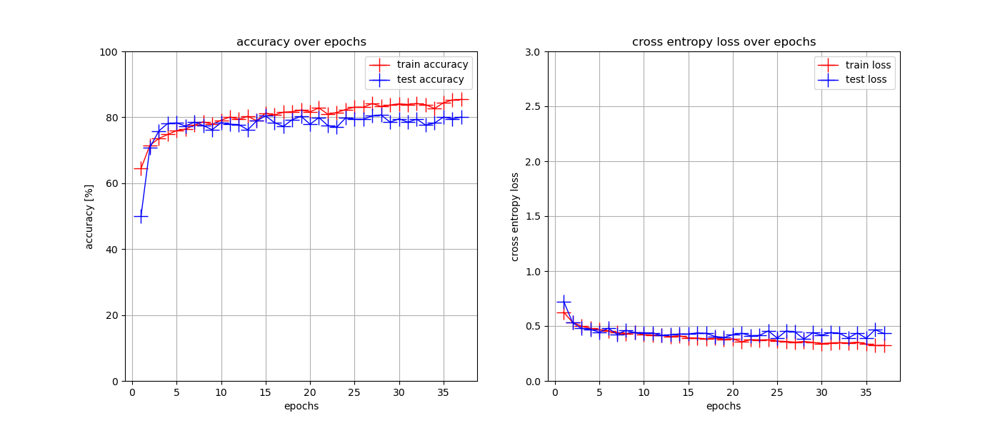
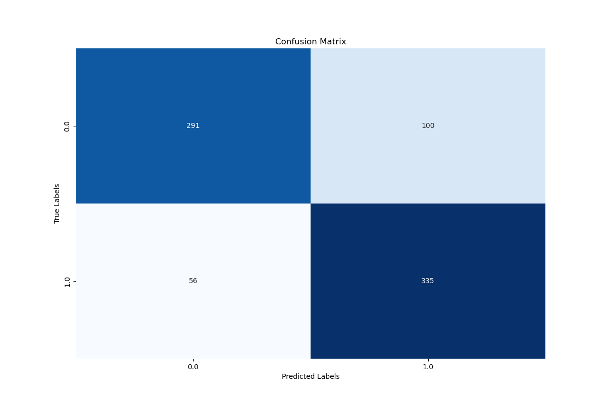

Skin-cancer MNIST10000 Dataset: Training an CNN using *pytorch* and Baysian Optimization in *optuna*
---

Author: Stefan Rietzinger, Date: 12.1.2025

---
### Summary
The objective of this project is to train a Convolutional Neural Network (CNN) to classify cancerous melanoma cases from the [*skin-cancer MNIST 10000*](https://www.kaggle.com/datasets/kmader/skin-cancer-mnist-ham10000) dataset without the use of pre-trained models. The **pytorch** framework was utilised to define the CNN architecture, while **optuna** was employed for hyperparameter tuning via Bayesian optimisation. The model was trained on an "NVIDIA GeForce RTX 4060" with 8GB DDR6 VRAM. 

In order to execute the code, it is first necessary to install the environment using Conda and the *environment.yml* file. The data must then be downloaded from [Kaggle Hub](https://www.kaggle.com/datasets/kmader/skin-cancer-mnist-ham10000) and stored in a folder located one step outside the designated run folder.

--- 
### Files overview:
- The program includes a *main.py* file for constructing and evaluating a CNN using test data.
- The *search.py* file employs Optuna to perform hyperparameter tuning on the validation data. 
- The *lib* folder contains the library file for functions that were not included in the main files, such as plotting functions.
- The results of the "main.py" file can be found in the *results* folder, while the results of the "search.py" file can be found in the *search* folder.
---
### Challenges
The project encountered numerous challenges, including the following:
1. **Imbalanced Dataset:** The dataset was found to be imbalanced, necessitating the implementation of techniques such as undersampling to address this issue. The *_undersampling()* method was implemented directly within the custom dataset class.

2. **Overfitting:** Furthermore, the model exhibited a tendency to overfit. To address these challenges, a range of techniques were employed, including:
    - L2-regularization
    - Dropout rate
    - varying the models complexity
    - Early Stopping
    - Data Augmentation: *random flip* and *random rotation*

3. **Limited GPU RAM:** 
Due to the restriction of GPU-RAM to 8GB, the complexity of the models was constrained, necessitating the maintenance of a lower complexity level than would have been preferable.

---
### Hyperparameter tuning: 
The library [**optuna**] (https://optuna.org/) was utilised for the training of hyperparameters. The Hyperparameter tuning process can be observed in the search.py file. Of course the Hyperparameters were tuned on the validation-set.

In the context of single-objective optimisation, Optuna employs [*Bayesian optimisation*](https://en.wikipedia.org/wiki/Bayesian_optimization). This approach is expected to facilitate more expeditious and effective hyperparameter tuning in comparison to conventional methods such as "GridSearch" or "RandomSearch". The optimization process involves the simultaneous adjustment of multiple parameters, including those that govern the architecture of the CNN itself, in addition to those that regulate the regularization or learning rate.
- lr
- num_conv_layers
- optimizer
- weight_decay
- activation_func
- dropout_rate
- fc_size1
- conv_filters_2
- num_fc_layers
- use_batchnorm
- kernel_size
- conv_filters_1

The graph entitled "param_importances.png", located in the "search" folder, provides a visual representation of the Hyperparameter importances. The optimal solution was determined after 134 rounds, owing to the substantial number of tuning parameters.

It is also noteworthy that Optuna is capable of performing multi-objective optimisation through the utilisation of a genetic algorithm. [*NSGA-II algorithm*](https://pymoo.org/algorithms/moo/nsga2.html) (Non-dominated Sorting Genetic Algorithm II). It is planned that this will be used in the future for the development of a model that will maximise performance whilst minimising thel models complexity.

In the future, Cross-Validation could be used to get an even better estimate of the model's generalization performance and reduce the risk of overfitting to the training or validation data.

---
### Results:
Please refer to the *binary_outcome_final* folder within the *results* folder for the final results of this analysis. 
In order to test the model, both the training and the test sets were randomly undersampled to ensure an equal number of positive and negative samples. Consequently, a model that always predicts either a positive or a negative output will achieve an accuracy of 50%.

The final model ran for 34 epochs before EarlyStopping was triggered. In the following figure you can see the accuracy and the loss-function on the training and the test-dataset over all epochs:

This figure demonstrates that the model achieves stable accuracy and loss on both the training and test sets, indicating effective learning and generalisation with minimal overfitting.

The model achieved the following scores:
```text
              precision    recall  f1-score   support

         0.0       0.84      0.74      0.79       391
         1.0       0.77      0.86      0.81       391

    accuracy                           0.80       782
   macro avg       0.80      0.80      0.80       782
weighted avg       0.80      0.80      0.80       782
```
With the confusion matrix:


The CNN demonstrates strong overall performance in the binary classification task, achieving an accuracy of 80%. It demonstrates high precision for class 0.0 (84%), indicating an effective avoidance of false positives. However, its recall (74%) suggests that some true 0.0 cases may be overlooked. For class 1.0, the model demonstrates strong recall (86%), capturing most true positives, but its lower precision (77%) suggests some false positives for this class. The balanced F1-scores (0.79 for class 0.0 and 0.81 for class 1.0) underscore a favourable trade-off between precision and recall.

Possible rooms for improvements include: the implementation of a more complex structure, and the use of pre-trained models for the convolutional layers. However, the former option is only viable on another machine, given the limitation of my GPU RAM. 

---
